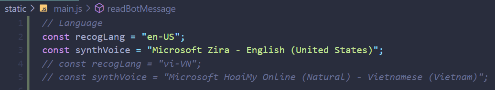
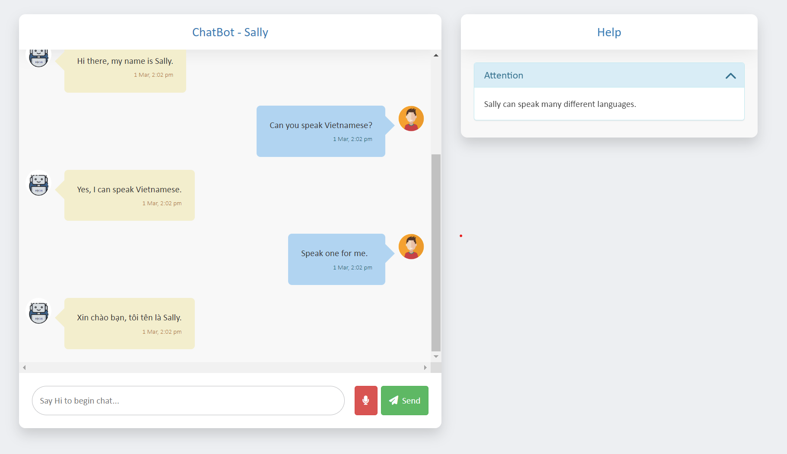

# Chatbot Sally - Friendly simple ChatGPT app

This is an example chatbot app base from the OpenAI API [quickstart tutorial](https://beta.openai.com/docs/quickstart). It uses the [Flask](https://flask.palletsprojects.com/en/2.0.x/) web framework. Chatbot can talk and reply to speech from user.

We add new feature that overcomes the weakness of ChatGPT - can't have updated information about weather, date and time with google search function.

## Setup

1. If you don’t have Python installed, [install it from here](https://www.python.org/downloads/)

2. Clone this repository

3. Navigate into the project directory

   ```bash
   $ cd wechatbot
   ```

4. Create a new virtual environment

   ```bash
   $ python -m venv env
   $ . env/bin/activate
   ```

5. Install the requirements

   ```bash
   $ pip install -r requirements.txt
   ```

6. Make a copy of the example environment variables file

   ```bash
   $ cp .env.example .env
   ```

7. Add your [ChatGPT API key](https://beta.openai.com/account/api-keys) and [Serp API key](https://serpapi.com/manage-api-key) to the newly created `.env` file

8. Addition config for Recognition Language and Synthesis Voices can find in `main.js`



9. Run the app

   ```bash
   $ flask run
   ```



You should now be able to access the app at [http://localhost:5000](http://localhost:5000)! For the full context behind this Python example app, check out the OpenAI [tutorial](https://beta.openai.com/docs/quickstart).
